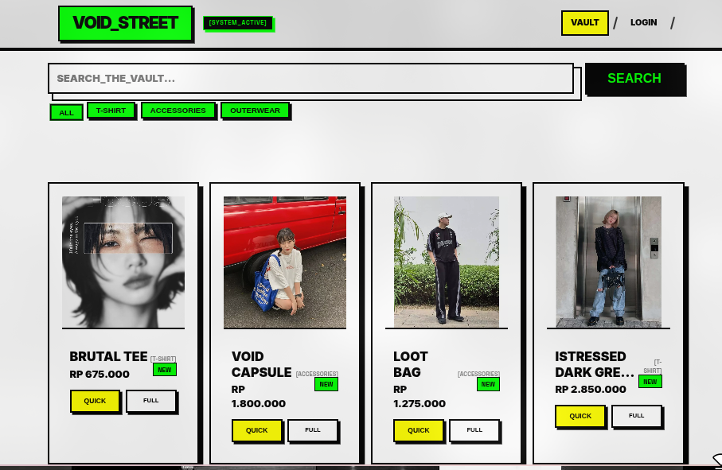
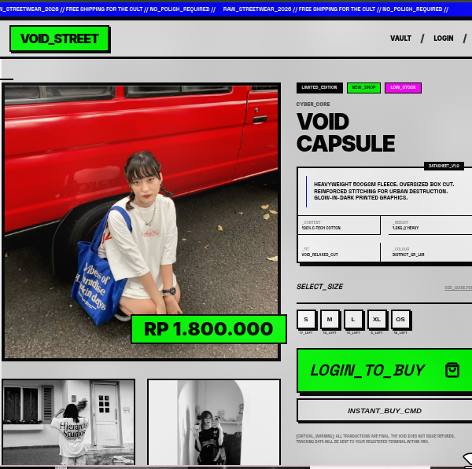
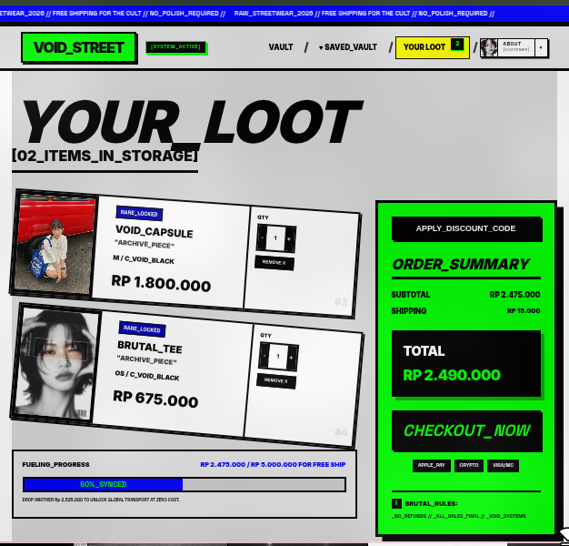
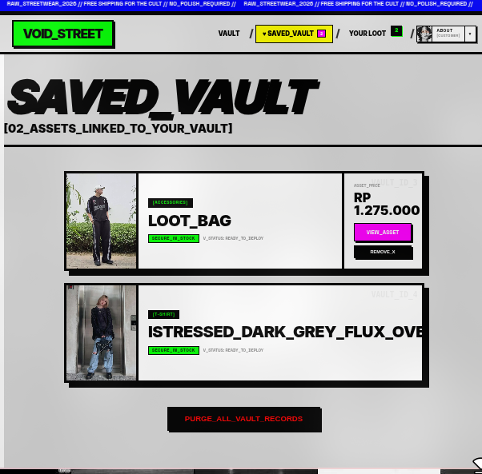
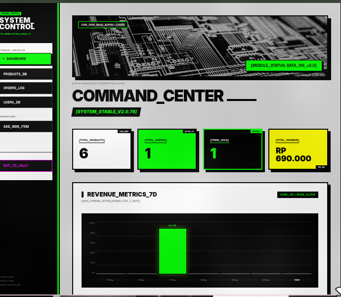

<p align="center">
  
  
  
  
</p>

# ⚔️ VOID_STREET

> **Underground Neo-Brutalist Streetwear E-Commerce Engine**

`VOID_STREET` is a high-contrast, zero-compromise underground digital storefront built on **Laravel**. Designed with a raw **Neo-Brutalist** aesthetic — screaming neon accents, oversized typography, heavy black borders, and hard-as-concrete structural grids — engineered for subversive fashion labels and streetwear collectibles.

---

## 🖤 THE DESIGN MANIFESTO

- **Zero Border-Radius** — All structural components locked into rigid rectangular blocks
- **Aggressive Outlines** — Heavy `4px`/`8px` solid black borders separating core compartments
- **Hard Isometric Shadows** — No blurry drop-shadows. Depth via strict flat translations (`box-shadow: 10px 10px 0px 0px #000`)
- **High-Contrast Accents** — Void Black, Subcultural Neon Green, Acid Pink, Industrial Yellow
- **Monospace Telemetry Labeling** — Bracketed monospace tags (`[ PROTOCOL_V1 ]`) for immersive terminal UX

---

## 💾 TECH STACK

| Layer | Tech |
|-------|------|
| Backend | PHP 8.x + Laravel 11 |
| Frontend | Blade Templates + Vanilla JS |
| Styling | Custom CSS (Neo-Brutalist Design System) |
| Build Tool | Vite |
| Database | MySQL |
| Storage | Laravel Storage (public disk) |
| Auth | Laravel Session Auth |

---

## ⚡ FEATURES

### 🔒 Auth System
- Register & Login with session management
- Role-based access: `customer`, `admin`, `developer`
- Ban system — blacklisted users hit a custom intercept screen with terminal-style UI

### 🧥 Product Catalog
- Responsive brutalist product grid
- Server-side category filter & keyword search
- Quick view modal per product card
- SEO-friendly URLs (`/product/{category}/{slug}`)

### 🔍 Product Detail
- Multi-image gallery (main + secondary images)
- Size selector with per-size stock counter
- Product specs panel (content, weight, fit, colour)
- Add to cart (auth required)

### 🛒 Cart & Checkout
- Full cart management (add, update quantity, remove)
- Free shipping threshold (Rp 5.000.000)
- Real-time cart count badge in navbar
- Checkout with saved address selection
- Multiple address management (add, edit, delete, set default)

### ⏱️ Order & Payment Simulation
- Order generated with unique order code (`VX-YYMMDD-XXXXX`)
- 15-minute payment countdown timer
- `SIMULATE_PAYMENT` trigger → status becomes `paid`
- Manual order expiry → status becomes `expired`
- Order detail page with full manifest

### ❤️ Wishlist — SAVED_VAULT
- Save/unsave products via AJAX (no reload)
- Dedicated `/wishlist` page with brutalist card layout
- Wishlist count badge in navbar
- Purge all with confirmation modal

### ⭐ Review System
- Star rating (1–5) with interactive selector
- Text review (body)
- Only verified purchasers (`paid` / `completed` orders) can review
- One review per product per user
- Average rating + distribution bar displayed on product page
- User avatar shown on each review card

### 👤 Profile
- Username & email update
- Password change
- Avatar upload
- Address book management
- Transaction history with order status

### 🛠️ Admin Panel
- **Dashboard** — Revenue chart (7 days), key stats, recent orders & products
- **Product CRUD** — Create, edit, delete products with multi-image upload
- **Featured Products** — Toggle which products appear on homepage
- **Order Management** — View all orders, filter by status, mark as completed
- **User Management** — View all users, ban/unban, change roles
- **Role Hierarchy** — `developer` > `admin` > `customer`
- **Pending Orders Badge** — Real-time count on sidebar

---

## 🧩 PROJECT STRUCTURE

```
VOID_STREET/
├── app/
│   ├── Http/
│   │   ├── Controllers/
│   │   │   ├── AuthController.php
│   │   │   ├── CartController.php
│   │   │   ├── CheckoutController.php
│   │   │   ├── ProductController.php
│   │   │   ├── ProfileController.php
│   │   │   ├── AddressController.php
│   │   │   ├── ReviewController.php
│   │   │   ├── WishlistController.php
│   │   │   └── admin/DashboardController.php
│   │   └── Middleware/
│   │       ├── CheckBanned.php
│   │       └── AdminMiddleware.php
│   └── Models/
│       ├── User.php
│       ├── Product.php
│       ├── ProductImage.php
│       ├── Size.php
│       ├── Order.php
│       ├── OrderItem.php
│       ├── Cart.php
│       ├── CartItem.php
│       ├── Address.php
│       ├── Review.php
│       └── Wishlist.php
├── resources/
│   └── views/
│       ├── layout.blade.php
│       ├── components/
│       │   ├── product-card.blade.php
│       │   └── modal.blade.php
│       ├── partials/
│       │   ├── navbar.blade.php
│       │   └── footer.blade.php
│       ├── errors/
│       │   └── 404.blade.php
│       └── pages/
│           ├── home.blade.php
│           ├── products.blade.php
│           ├── product-detail.blade.php
│           ├── cart.blade.php
│           ├── checkout.blade.php
│           ├── order-success.blade.php
│           ├── wishlist.blade.php
│           ├── profile.blade.php
│           ├── login.blade.php
│           ├── register.blade.php
│           └── banned.blade.php
├── routes/
│   └── web.php
├── database/
│   └── migrations/
└── public/
    └── storage/ (symlink)
```

---

## 🚀 INSTALLATION

### Requirements
- PHP >= 8.1
- Composer
- Node.js & NPM
- MySQL

### Steps

```bash
# 1. Clone branch development
git clone -b development https://github.com/CUKLIZ/Web-Brutalism.git
cd Web-Brutalism

# 2. Install PHP dependencies
composer install

# 3. Install JS dependencies
npm install

# 4. Copy environment file
cp .env.example .env

# 5. Generate app key
php artisan key:generate

# 6. Configure database in .env
DB_CONNECTION=mysql
DB_HOST=127.0.0.1
DB_PORT=3306
DB_DATABASE=void_street
DB_USERNAME=root
DB_PASSWORD=

# 7. Run migrations
php artisan migrate

# 8. Link storage for images
php artisan storage:link

# 9. Seed sizes (REQUIRED)
php artisan tinker
>>> App\Models\Size::insert([['name'=>'S'],['name'=>'M'],['name'=>'L'],['name'=>'XL']])

# 10. Build assets
npm run build

# 11. Serve
php artisan serve
```

App runs at `http://localhost:8000`

### Create Developer Account
```bash
php artisan tinker
>>> App\Models\User::create([
    'username' => 'developer',
    'email'    => 'dev@voidstreet.com',
    'password' => bcrypt('your_password'),
    'role'     => 'developer'
])
```

---

## 🔄 WORKFLOW

### User Flow
1. Browse catalog freely without login
2. Login required to add to cart, wishlist, or checkout
3. Select size → add to bag
4. Checkout → select address → payment method → place order
5. Simulate payment within 15 minutes
6. After order `paid` or `completed` → can leave a review

### Admin Flow
1. Login with admin/developer account
2. Access `/admin` dashboard
3. Manage products, orders, users from sidebar

---

## 🗺️ ROADMAP

- [x] Auth system (register, login, ban)
- [x] Role hierarchy (customer, admin, developer)
- [x] Product catalog with server-side search & filter
- [x] Cart & checkout flow
- [x] Order management & payment simulation
- [x] Wishlist (SAVED_VAULT)
- [x] Review & rating system
- [x] Admin panel (products, orders, users)
- [x] Custom 404 & banned pages
- [x] SEO-friendly product URLs
- [ ] Real payment gateway (Midtrans / Xendit)
- [ ] Email notifications (order confirmation, status update)
- [ ] Coupon / promo code system
- [ ] Dark mode toggle
- [ ] Analytics dashboard for admin
- [ ] Low stock alerts
- [ ] Mobile responsive improvements

---

## 📸 SCREENSHOTS

### 🖥️ Catalog


### 👗 Product Detail


### 🛒 Cart


### ❤️ SAVED_VAULT (Wishlist)


### ⚙️ Admin Panel


---

## 🎨 COLOR PALETTE

```
--brutal-black:  #0a0a0a
--neon-green:    #A3FF00
--accent-yellow: #FFE500
--accent-pink:   #FF006E
--gallery-white: #F5F5F5
```

---

## 🔗 BRANCHES

| Branch | Description |
|--------|-------------|
| `main` | ⚡ Frontend prototype — design only |
| `development` | ⚔️ Full Laravel + MySQL implementation — you are here |

---

## 📄 LICENSE

MIT License — Built for the underground, open for the culture.

---

<div align="center">
  <strong>BUILT FOR THE UNDERGROUND. NO_POLISH_REQUIRED.</strong>
  <br><br>
  <code>VOID_STREET © 2026</code>
</div>
